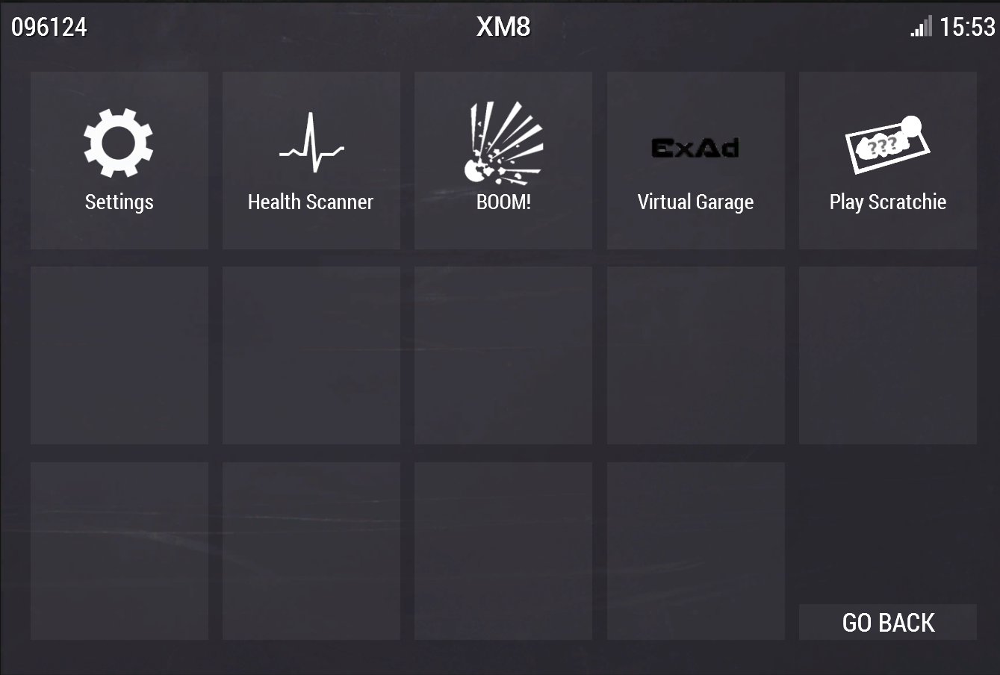
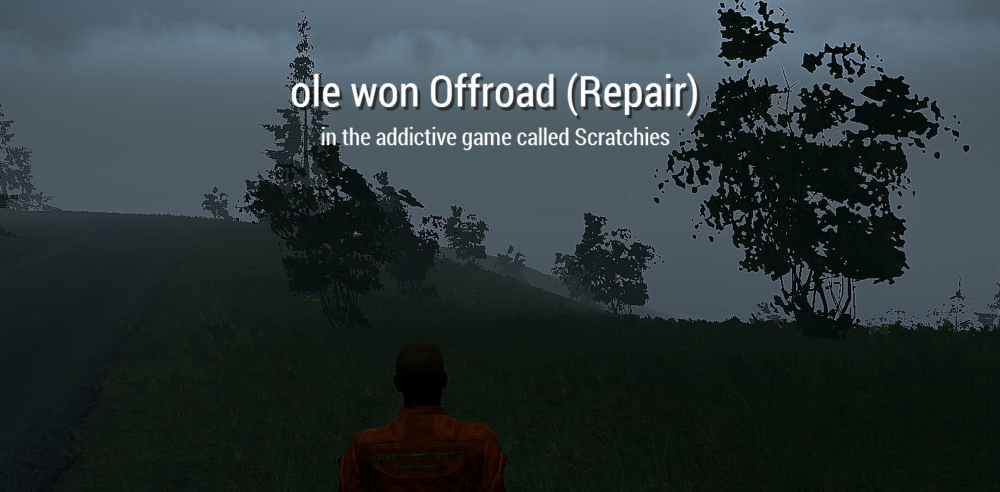

## Scratchies (*lottery like* minigame for Exile Mod)
[](https://github.com/ole1986/a3-exile-scratchie/releasese)
[](https://github.com/ole1986)
[](http://www.exilemod.com/downloads/)
[]
[](https://www.bistudio.com/community/licenses/arma-public-license)

<p align="center">
    
    
</p>
<p align="center">
    
    
    
</p>

Videos: [PART #1](https://www.youtube.com/watch?v=zVPXYhhYrbU) [PART #2](https://www.youtube.com/watch?v=2MC45ycnOkc) - thanks to Rythron

## Requirements

* Arma 3 with [ExileMod 1.0.4](http://www.exilemod.com/downloads/)

## Installation

By default this package is shipped with a `build` folder containing all neccessary file to be copied. Please follow the below steps to install the required server and mission files

* Copy the folder `build\@ScratchieServer` into your Arma 3 server directory
* Copy the mission file located in `build\@MissionFile` into your Arma 3 serer `mpmission` directory

To allow the scratchie mod using some database commands it is important replace the `@ExileServer\extDB\sql_custom_v2\exile.ini` with `mysql\exile.ini` and overwrite

## Database Setup

The Scratchie mod requires some database tables being installed onto your database server (similar to the ExileMod).
In the below example, we use the **mysql client from command line** install the `mysql\scratchie.sql` file

```
C:\User\xxx\Downloads\a3-exile-scratchie> mysql -uexile -p exile
mysql> source mysql\scratchie.sql
```

## Battleye

When you use Battleye, please amend the below BE files to allow remote calls

**scripts.txt**

+ add the below to the end of line `7 remoteexec`

 `!="remoteExecCall [\"ExileServer_lottery_network_request\"," !="remoteExecCall ['ExileServer_lottery_network_request',"`
 
**remoteexec.txt**

+ add the below to the end of line `7 ""`

 `!"ExileServer_lottery_network_request"`

## Run Arma 3

### Server

Once all steps are properly done (without errors) it is time to restart the server. Most important here is to include the `@ScratchieServer` mod into the startup parameter. See below example

`arma3server.exe -autoInit  "-profiles=xxx" "-config=xxx\server.cfg" -serverMod=@ScratchieServer;@ExileServer -mod=@Exile`

### Client

Make sure `@Exile` mod is enabled when running Arma 3

# Advanced User / Developer

As this project uses the ArmaDev extension for Visual Studio Code (vscode) the instruction will strongly focus on the use of this extension.

## Requirements

* All requirements from the **Installation** chapter
* [Arma 3 Tools](https://community.bistudio.com/wiki/Arma_3_Tools_Installation) (for advanced configuration)
* [ArmaDev extension](https://marketplace.visualstudio.com/items?itemName=ole1986.arma-dev) for (for development)

**PLEASE NOTE:** This guide is addressed to advanced users and developers

## Configure Scratchie

You can find the configuration (including explanation) in `source\scratchie_server\config.cpp`.
This configuration file can be customized and must be repacked into the `build\@ScratchieServer\addons\scratchie_server.pbo`

To repack the pbo file, please use the following ArmaDev extension command from vscode: `Arma 3: Build`

## Patch a mission file

While this is shipped with the "common" mission file, fully patched and ready to run, you may want to build your own mission file.

(Instruction will follow soon)