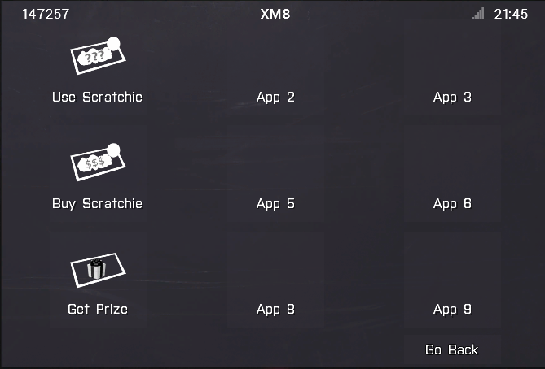

## Scratchies (*lottery like* minigame for Exile Mod) v0.7
<sub>This extension is licensed under the Arma Public Licence - Author: ole1986</sub>

**<a href="https://github.com/TheeMrshix/XM8-Apps">xm8Apps</a> compatible - see section <a href="#missionfile">MissionFile</a>**

<p align="center">
    
    
</p>
<p align="center">
    
    
    
</p>

Videos: [PART #1](https://www.youtube.com/watch?v=zVPXYhhYrbU) [PART #2](https://www.youtube.com/watch?v=2MC45ycnOkc) - thanks to Rythron

## Installation

This README uses some placeholders

Placeholder            | Description
---------------------- | -------------
&lt;MissionFile&gt;    | Exile.&lt;Mapname&gt;.pbo (E.g. Exile.Altis.pbo )
&lt;ExileServerMod&gt; | @ExileServer Exile server mod folder located in game directory.

### Required Tools

+ PBO Manager (I use cpbo from http://www.kegetys.fi/category/gaming/armamods/)
+ Notepad++ or any other Text Editor (https://notepad-plus-plus.org/)
+ Exile Mod version 0.9.41

### Database setup

+ Import the mysql file `mysql\lottery.sql` into your exile database (through mysql or phpmyadmin for example).
+ Copy and repalce the `mysql\exile.ini` with the file located in `<ExileServerMod>\extDB\sql_custom_v2\exile.ini`

### MissionFile

+ **Unpack** the `<MissionFile>`

**Option 1: Standalone**

+ Copy the folders `MissionFile\overrides` and `MissionFile\addons` into your `<MissionFile>` directory
+ Modify the `<MissionFile>\config.cpp` and add the below line inside `class CfgExileCustomCode`

```
ExileClient_gui_xm8_slide_apps_onOpen = "overrides\ExileClient_gui_xm8_slide_apps_onOpen.sqf";
```

**Option 2: xm8Apps**
 <p align="center"></p>

+ Install xm8Apps as described in the <a href="https://github.com/TheeMrshix/XM8-Apps/blob/master/README.md">README.md from TheeMrshix</a>
+ Copy and replace the folder located in `MissionFile\xm8Apps` with your `xm8Apps` folder in your mission file

**Option 1/2:**

+ Modify the `<MissionFile>\description.ext` and add the below line inside  `class CfgRemoteExec -> class Functions`

```
class ExileServer_lottery_network_request { allowedTargets=2; };
```

### Exile Server

+ Copy the `ExileServerMod\scratchie_server.pbo` into your `<ExileServerMod>\addons` directory

*PLEASE MAKE SURE YOU HAVE REMOVED ALL PREVIOUS FILES FROM THE exile_server.pbo*

### Buy / Get Prize code line

*The below code can be used to buy a scratchie from any object you decide*

`["buy",ExileClientSessionId, player, ""] remoteExecCall ["ExileServer_lottery_network_request", 2];`

*The below code can be used to get the prize, when player has won*

`["get",ExileClientSessionId, player, ""] remoteExecCall ["ExileServer_lottery_network_request", 2];`

**Example implementation to Buy/Get Prize from the office (&lt;MissionFile&gt;\initPlayerLocal.sqf)**
```
_officeTrader = [
    "Exile_Trader_Office",
    "GreekHead_A3_04",
    ["InBaseMoves_SittingRifle1"],
    [0, -0.15, -0.45],
    180.008,
    _chair
]
call ExileClient_object_trader_create;
// add the buy scratchie and get prize as action menu to the office trader
_officeTrader addAction ["<t color='#FFFFFF'>Buy Scratchie(200,-)</t>", { ["buy",ExileClientSessionId, player, ""] remoteExecCall ["ExileServer_lottery_network_request", 2]; }];
_officeTrader addAction ["<t color='#c72651'>Get Prize!</t>", { ["get",ExileClientSessionId, player, ""] remoteExecCall ["ExileServer_lottery_network_request", 2]; }];
```

### Battleye

+ add the below to the end of line `7 addAction` in your scripts.txt (important for office trade action menu)

 `!="officeTrader addAction"`
 
+ add the below to the end of line `7 remoteexec` in your scripts.txt (important for buy/use and get prize)

 `!="remoteExecCall [\"ExileServer_lottery_network_request\"," !="remoteExecCall ['ExileServer_lottery_network_request',"`
 
+ add the below to the end of line `7 ctrlCreate` (important for xm8 implementation)
 
 `!="ctrlCreate [\"RscExileXM8ButtonMenu\", 9898,"`

+ add the below to the end of line `7 ""` in your remoteexec.txt (important for buy/use and get prize)

 `!"ExileServer_lottery_network_request"`
